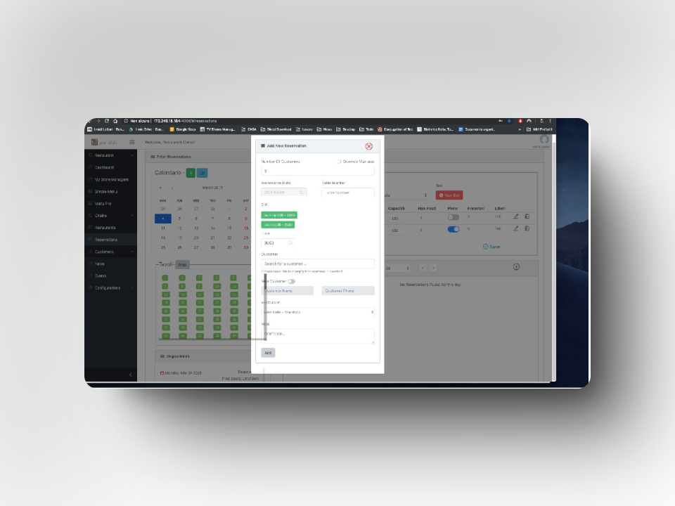

# 🚀 Getnet Endaylalu - Fullstack Developer

Welcome to my portfolio! I’m passionate about building impactful products, solving problems, and constantly learning to grow my skills and improve communication. I thrive on creating solutions that make a difference and enjoy every opportunity to collaborate and innovate.

## 📂 Real World Projects Portofilo

### 1️⃣ **1health Next Gen**

- **Description:** The project aimed to streamline testing ordering and results in an efficient manner by consolidating different stakeholders onto one platform (labs, doctors, health providers, and suppliers).
- **Role:** React | GraphQL Developer
- **Work Done:**
  - Developed user interfaces using React.js
  - Enhanced component performance through optimization techniques
  - Contributed to the rapid deployment of products, ensuring they were ready for use within a few weeks of development
  - Delivered high-quality UI/UX designs that were well-received by product owners and the team
  - Optimized project bundle sizes by efficiently utilizing packages for improved performance
  - Integrated back-end services using GraphQL and REST APIs
  - Co-developed real-time communication systems for proctoring purposes using Twilio
- **Skills:** React.js,jQuery,TypeScript, REST APIs, Material UI
- **Live Site:** [🔗 https://app.1health.io/](#)
- **Client:** 1health[🔗 https://www.1health.io/]
- **Client Location:** US
- **Company:** Panaton software [🔗 https://www.panaton.com/]
- **Duration:** Aug 26 2021 - Jan 1 2024 **-** 2.5 Years

### 2️⃣ **Efflux**

- **Description:** A platform for tracking campaigns, launching ads, and analyzing ad spend and revenue.
- **Role:** Fullstack Developer
- **Work Done:**

  - Effectively utilized the Facebook Marketing API to create a custom ad-launching solution
  - Created an ad launcher interface to launch ads on Facebook via the Facebook Marketing API
  - Utilized Amazon Web Services (AWS) S3 for file uploads
  - Monitored logs and resolved bugs using AWS CloudWatch
  - Integrated Facebook Marketing API for custom ad launches
  - Developed user interfaces using React.js

- **Skills:** React.js,Node.js,AWS services, PostgreSQL.
- **Live Site:** [🔗 https://efflux.com/](#)
- **Client:** ROI ADS[🔗 https://roixads.com/]
- **Client Location:** US
- **Company:** ROI ADS
- **Duration:** Feb 27 2024 - July 1 2024 **-** 4 months

### 3️⃣ **FrontM Website Development**

- **Description:** It is a website for their Maritime SupperApp Platform for ship-shore team communications, collaboration, engagement, and welfare.
- **Role:** Frontend Developer (Next.js)
- **Work Done:**

  - Developed user interfaces using Next.js
  - Connected sanity api for fetching news updates

- **Skills:** Next.js,Sanity,HTML/CSS,javascript.
- **Live Site:** [🔗 https://frontm.com/](#)
- **Client:** FrontM[🔗 https://frontm.com/]
- **Client Location:** UK
- **Company:** FrontM
- **Duration:** Jan 5 2024 - March 26 2024 **-** 3 months

### 4️⃣ **Vereitalie Resturant Management System**

- **Description:** This project was both vast and intricate, encompassing both Web De- velopment and Mobile Development aspects. As a versatile team member, I contributed as a developer, proficient in React and iOS technologies, and also provided valuable support as a QA (Quality Assurance) specialist.
- **Role:** Junior Software Developer
- **Work Done:**

  - Developed user interfaces for the restaurant management system using React.js
  - Collaborated in the creation of an iOS app designed to streamline the order-taking process within the restaurant management system, significantly improving operational efficiency
  - Identified and reported numerous subtle issues, ensuring a bug-free application upon release
  - Led the QA team, ensuring high standards of quality and performance across the project

- **Skills:** iOs Developement,React,Javascript,QA.
- **Live Site:** [🔗 obselte as of now](#)
- **Client:** Vereitalie Resturant[🔗 https://vereitalie.it]
- **Client Location:** Italy
- **Company:** Med Innnovations Addis (Owned by Vereitalie Resturant owner )
- **Duration:** Aug 1 2019 - Aug 31 2020 **-** 1.1years

## 📂 Personal Projects

### 1️⃣ **Personal Fiance Managament Project with AI assistant**

- **Description:** This application helps users track their income and expenses effectively.
- **Role:** Fullstack developer
- **Work Done:**

  - Built interactive UI components for tracking expenses,incomes and setting financial goals
  - Created Database Schema and Migration
  - Made api-end points for various tasks
  - Integreted AI assistant chatbot
  - Managed CI/CD using Github actions
  - Used AWS services (EC2 & Amplify) for deployment

- **Skills:** Vue.js,Node.js,SQL,Supabase(PostgreSQL),AWS(EC2),CI/CD(git actions).
- **Live Site:** [🔗 https://main.doyar4u9sxfwi.amplifyapp.com/](#)
- **Duration:** Sep 16, 2024 - present

## 🛠 Skills & Technologies

- **Frontend:** React.js, Vue.js, Next.js
- **Backend:** Node.js, Express.js
- **Database:** PostgreSQL, Supabase
- **Styling:** Material UI, Tailwind CSS
- **Other:** TypeScript, REST APIs, Git, AWS S3

## 📬 Contact Me

- **LinkedIn:** [https://www.linkedin.com/in/getnet-endaylalu/](#)
- **Email:** [getnetendaylalu2015@gmail.com](mailto:getnetendaylalu2015@gmail.com)

Feel free to check out my projects and reach out for collaboration! 🚀
